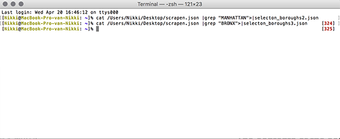

# New York City Crimes

##Source
 

This is the web page where we use our data from. 

https://data.cityofnewyork.us/Public-Safety/NYPD-7-Major-Felony-Incidents/hyij-8hr7

 
## The purpose of the research, research goal or hypothesis
 
The purpose of this research is to discover what kind of crime is most common in which borough. We have decided to focus on three neighborhoods that are very different from each other in terms of amount of tourism in that area and the general image of the wealth in that area. Manhattan is the paragon of an upperclass neighborhood with heaps of tourism while Bronx on the other hand contains one of the five poorest districts in the US and has relatively high crime rates. We chose Brooklyn as a third borough because it seems like the in between category. Lively area’s with nice living areas. 

The file we found focuses on 7 felonies:  
- grand larceny  
- rape  
- burglary 
- robbery 
- grand larceny of motor vehicle 
- felony assault 
- murder  
 
Our hypothesis that more serious felonies such as murder and rape happen more often in the Bronx while petty felonies as robbery happen more often in Manhattan where tourist are an easy target. Brooklyn is probably in between those borough in these matters. 

 
## The contents of the source data
 
Our source data contains, as stated before, the information of 7 different felonies in five different boroughs in New York City District.  

## How did we get it?

- download the file from the page as .csv file 
- open the file in excel and indicate that every comma need to be a new collom
- save the file and copy it
- make a .json file from the data (this is a handy web page for the translation: https://shancarter.github.io/mr-data-converter/)
- now you have a .json file but it is way to big to open it. So you need to contain the information you need. We choose for the tree boroughs. 
- open the terminal and type in (image): cat (the place where your .json file is restord) |grep "(the thing you want to filter out, like MANHATTAN)" >(newfilename).json 
- so now the terminal made a new file where only manhattan is part of it. And you have your new, smaller file. 

## Collaborators

- Isabel Zoetbrood
- Lola Beumer
- Nikki Gersen

   