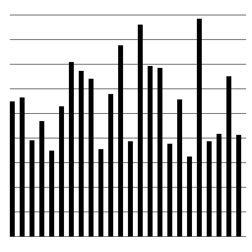
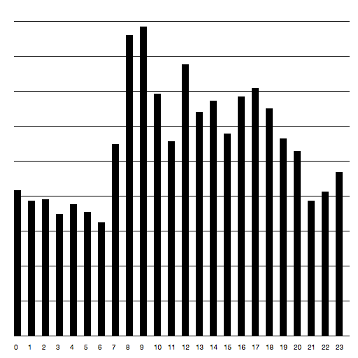

# New York City Crimes

##Source
 

This is the web page where we use our data from. 

https://data.cityofnewyork.us/Public-Safety/NYPD-7-Major-Felony-Incidents/hyij-8hr7

 
## The purpose of the research, research goal or hypothesis
 
The purpose of this research is to discover what kind of crime is most common in which borough. We have decided to focus on three neighborhoods that are very different from each other in terms of amount of tourism in that area and the general image of the wealth in that area. Manhattan is the paragon of an upperclass neighborhood with heaps of tourism while Bronx on the other hand contains one of the five poorest districts in the US and has relatively high crime rates. We chose Brooklyn as a third borough because it seems like the in between category. Lively area’s with nice living areas. 

The file we found focuses on 6 felonies:  
- rape  
- burglary 
- robbery 
- grand larceny of motor vehicle 
- felony assault 
- murder  
 
Our hypothesis that more serious felonies such as murder and rape happen more often in the Bronx while petty felonies as robbery happen more often in Manhattan where tourist are an easy target. Brooklyn is probably in between those borough in these matters. 

 
## The contents of the source data
 
Our source data contains, as stated before, the information of 6 different felonies in five different boroughs in New York City District.  

## How did we get it?

- download the file from the page as .csv file 
- open the file in excel and indicate that every comma need to be a new collom
- save the file and copy it
- make a .json file from the data (this is a handy web page for the translation: https://shancarter.github.io/mr-data-converter/)
- now you have a .json file but it is way to big to open it. So you need to contain the information you need. We choose for the tree boroughs. 
- open the terminal and type in (image): cat (the place where your .json file is restord) |grep "(the thing you want to filter out, like MANHATTAN)" >(newfilename).json 
- so now the terminal made a new file where only manhattan is part of it. And you have your new, smaller file. 

##1st itteration

- We now knew what data we wanted to work with.
- The next step was to visualise how we wanted the posters to look. 
- we made a sketch in illustrator.

##Data analysis

- Using plot device, we started analysing the data we had collected.
- The first element we analysed was the which crimes had happened in the boroughs by writing a code in which the json files were scanned on crime.  
- As outcome we got the list of crimes with the amount of occurrences.
- Our main question then became: What crime happens most often at which hour? So instead of filtering the json file on amount per crime we wrote a code which filtered the crimes on hours en lister their counts. Now we had exactly the data we needed. 

##Stap 2 Plotdevice 

- With the relevant data we started sketching with the help of the example of the visualising the long tail. 
- In Plotdevice we used the same code as we had used for the analysis; only now we added the part of code that visualised this data. [graph code](stap_2_plotdevice/brooklyn/brooklyn_bulglary_grafiek.pv)
-The first part of the code consisted of the analysis, of which the results are printed in the box below

-The second part adds the hours underneath the bargraph
-The third part draws the bargraph 
- The fourth part draws the horizontal lines which indicate the amount of crimes, every bar stands for 50 crimes 

 - the code was good enough because the data wasnt clear what what was. 
 - the next step was to inlcude the hours and make it orginized
 
 
 

- because of the big file we had we again made a selection of the data we eventually needed. This we did by making a extra part of code in the plotdevice file, where the data we needed exported to a new json file. 

## Collaborators

- Isabel Zoetbrood
- Lola Beumer
- Nikki Gersen

   